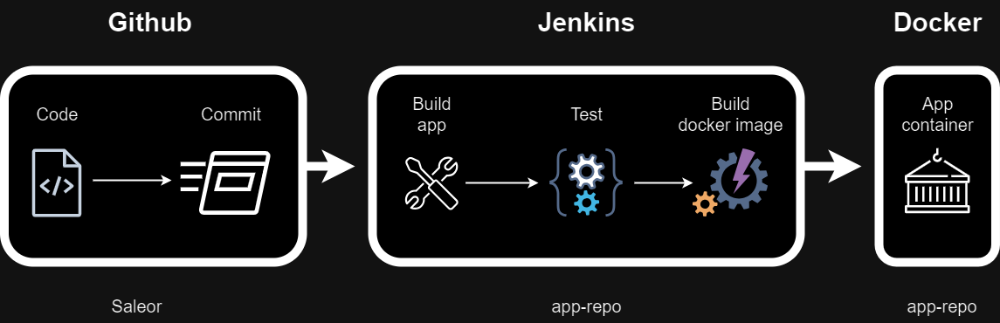

# CI/CD Pipeline for Saleor Application

This repository contains the CI/CD pipeline setup for the Saleor application. The pipeline leverages Jenkins, Docker, and GitHub to automate the process of building, testing, and deploying the application.

## Overview

The CI/CD pipeline is designed to automate the following steps:

1. Code changes are committed and pushed to GitHub.
2. GitHub triggers Jenkins to start the build process.
3. Jenkins pulls the latest code from the repository.
4. Jenkins builds and tests the application.
5. Jenkins creates a Docker image of the application.
6. Jenkins pushes the Docker image to a Docker registry.
7. The Docker image is deployed to the staging or production environment.

## Repository Structure

We have two main repositories in our GitHub organization:

**infra-repo:** Contains infrastructure configuration and deployment scripts.
**app-repo:** Contains the Saleor application code and the Jenkinsfile.

## CI/CD Pipeline Details

#### 1. Code Commit and Push
Developers work on feature branches and commit their changes to the GitHub repository. Once changes are ready, they are pushed to the main branch, triggering the CI/CD pipeline.

#### 2. GitHub Webhook to Jenkins
GitHub is configured to send a webhook to Jenkins whenever a new commit is pushed to the main branch. The webhook contains information about the commit and triggers Jenkins to start the build process.

#### 3. Jenkins Build Process

	a. Pull Latest Changes
Jenkins receives the webhook and pulls the latest changes from the GitHub repository (both infra-repo and app-repo).

	b. Build and Test
Jenkins executes the following steps defined in the Jenkinsfile located in the app-repo:

Build: Jenkins compiles the application code.
Test: Jenkins runs automated tests, including unit tests, integration tests, and end-to-end tests.

	c. Docker Image Creation
If the build and tests are successful, Jenkins proceeds to create a Docker image of the Saleor application using the Dockerfile located in the app-repo.

	d. Push Docker Image
The newly created Docker image is then tagged with the build version and pushed to a Docker registry (e.g., Docker Hub or a private Docker registry).

#### 4. Deployment to Staging/Production
Once the Docker image is pushed to the registry, Jenkins can automatically deploy the image to the staging or production environment. Deployment scripts in the infra-repo manage this process, ensuring the application is correctly configured and running in the target environment.

## Diagram

Here is a visual representation of the CI/CD pipeline:

## Conclusion

This CI/CD pipeline ensures that the Saleor application is automatically built, tested, and deployed with every commit, improving the efficiency and reliability of our development process. By leveraging Jenkins, Docker, and GitHub, we maintain a consistent and reproducible environment for our application across different stages of development and production.
